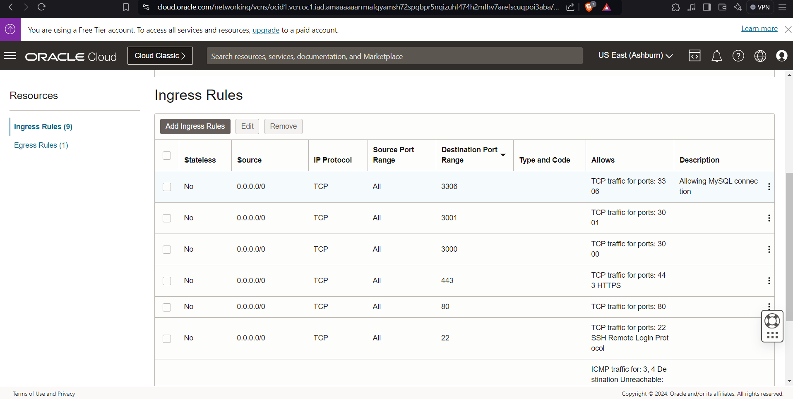

# React.js Frontend - Jogo da Onça:

This repository contains the frontend code for [Jogo da Onça](https://github.com/IES300-Jogo-da-Onca) project, that is a digital reinterpretation of the traditional board game from the Bororo indigenous.
[Read more](https://en.wikipedia.org/wiki/Adugo)

Play it [here](https://jogodaonca.fr.to/)

## Getting Started:

> This project was bootstrapped with [Create React App](https://github.com/facebook/create-react-app).

### Prerequisites:

- **Node.js** v16 or above;

### Installation

1. Clone this repository: `git clone https://github.com/IES300-Jogo-da-Onca/jogo-da-onca.git` ;
2. Navigate to the project folder in the terminal;
3. Install dependencies: `npm install` ;
4. Create a .env file based on .env.example, setting the necessary variables.
5. Run `npm start` to launch the development server, which will be available at http://localhost:3000.

### Tips:

1. Explore the [Jogo da Onça API](https://github.com/IES300-Jogo-da-Onca/api) repository for backend details;
2. Gain "Super User" access by setting "ehSuperUser" to 1 in the "usuario" table of the database. This enables access to the game's frontend management interface.

## Deployment

    This version was tested only on Ubuntu Server 22.04, so this documentation describes this process.
    Before Starting be shure to install and to start NGINX:

    ```bash
    sudo apt update
    sudo apt install nginx
    sudo systemctl start nginx
    sudo systemctl enable nginx
    sudo systemctl status nginx
    ```

1. Install NGINX and generate optimized build:

```bash
npm run build
```

2. Zip and send it to the server that will host it:

```bash
tar -zcvf build-jdo-{verssion}.tar.gz
```

3. Unzip and save the generated build to /var/www/jdo/frontend on your production server:

```bash
tar -xvzf build-jdo-{verssion}.tar.gz
sudo mkdir /var/www/jdo
sudo mkdir /var/www/jdo/frontend
sudo cp -r ./build/ /var/www/jdo/frontend
```

4. Firewall Config:
   By default this application runs at port 3000, so first you need to open this port at any firewall that secures you production environment. For example, in a Oracle Cloud instances, you need first to open this and any other port you'll need to open for internet requests at Subnet Ingress Rules:



As well, you need to configure your Ubuntu machine Firewall to open these ports as well. You can do it with ufw command or with iptables adding the following lines in /etc/iptables/rules.v4 file:

```bash
 -A INPUT -p tcp -m state --state NEW -m tcp --dport 3000 -j ACCEPT
 -A INPUT -p tcp -m state --state NEW -m tcp --dport 3001 -j ACCEPT
```

Then apply changes with the following command:

```bash
sudo iptables-restore < /etc/iptables/rules.v4
```

5. Copy the 'nginx.conf' file, on the project root, to /etc/nginx/sites-available/jogo-da-onca, remove default nginx page and create a link for /etc/nginx/sites-enabled:

```bash
sudo unlink /etc/nginx/sites-enabled/default
sudo ln -s /etc/nginx/sites-available/jogo-da-onca /etc/nginx/sites-enabled/
```

6. Test and reload NGINX:

```bash
sudo nginx -t
sudo systemctl reload nginx
```

### Project Screen Shots


### Reflection

It was a profound journey of both cultural exploration and software engineering. Renowned by its original Bororo name, Adugo, this digital adaptation served as a captivating intersection of tradition and technology. Undertaken during the first semester of 2022, the project became a testament to four months of rigorous dedication, serving as a pivotal criterion for approval in the challenging Software Engineering III course at FATEC São Paulo. Under the insightful guidance of Teacher Victor Troitiño, who not only challenged but also mentored us throughout the project, we navigated the complexities of cultural preservation and coding intricacies. The gratitude we feel for his guidance is immeasurable, as he played a pivotal role in steering us through this multifaceted project, ultimately making the journey of "Jogo da Onça" a deeply rewarding and enlightening experience.
