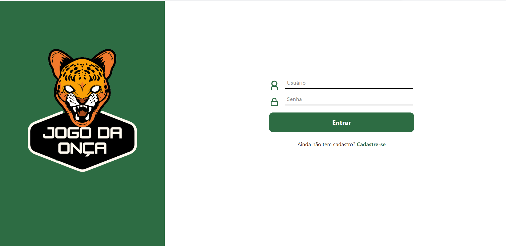
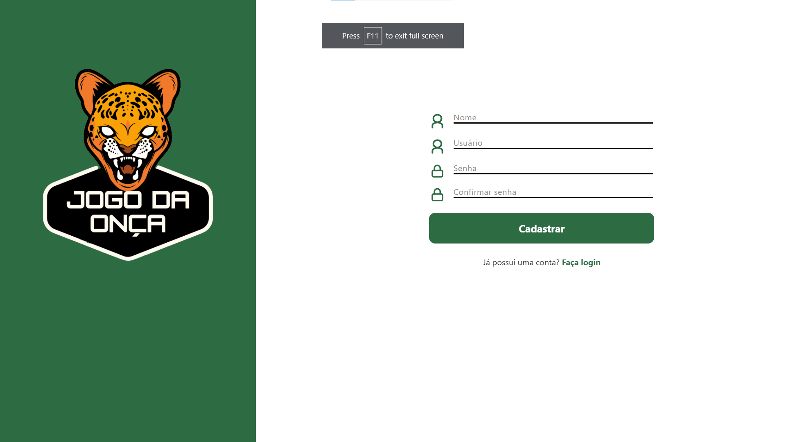
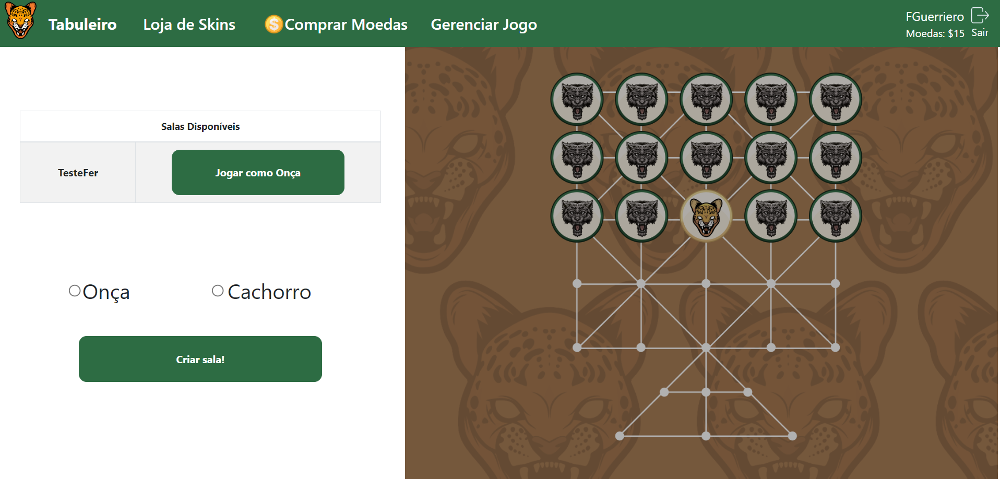
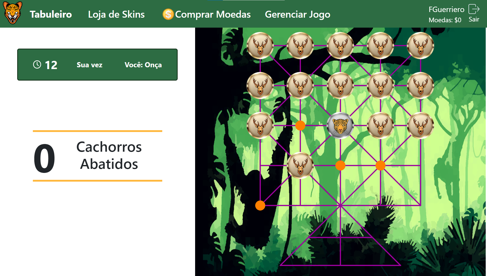
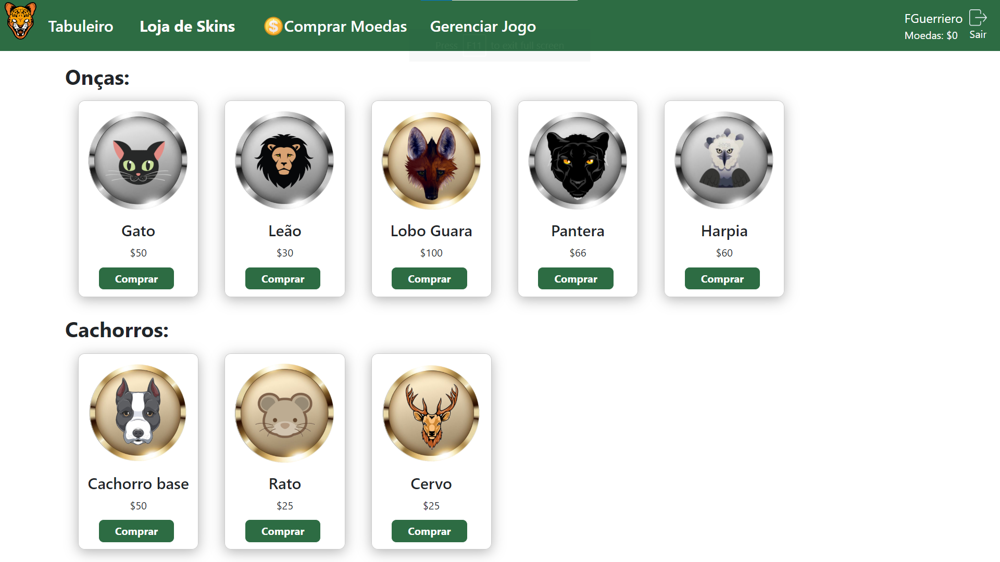
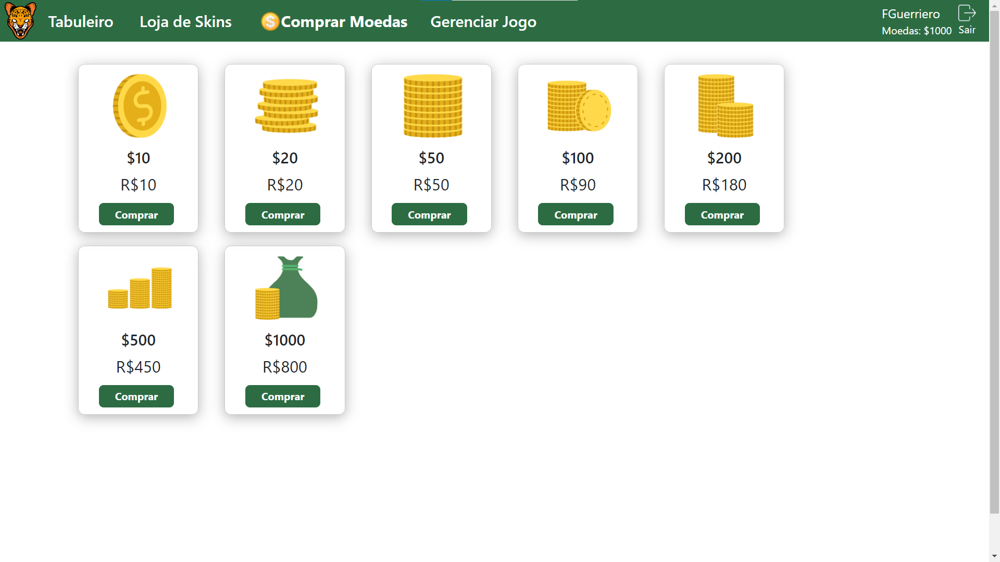
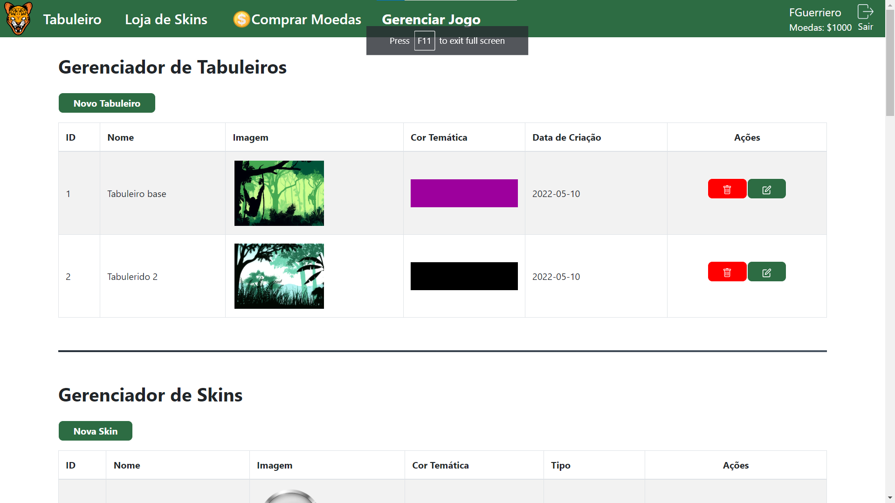
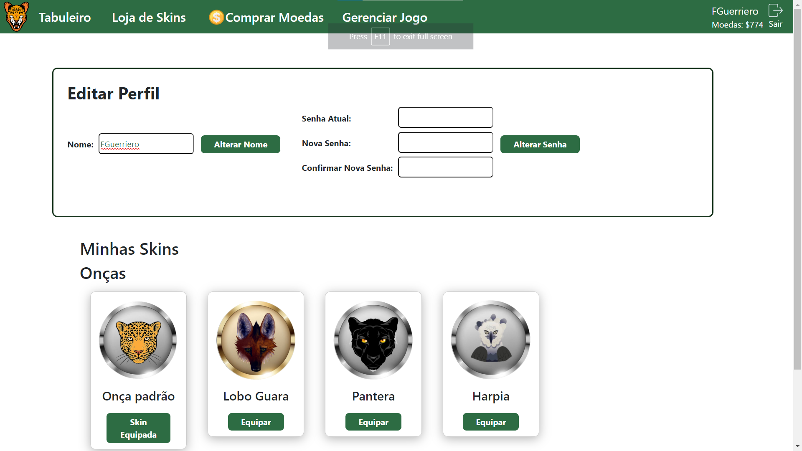

# React.js Frontend - Jogo da Onça:

This repository contains the frontend code for [Jogo da Onça](https://github.com/IES300-Jogo-da-Onca) project, that is a digital reinterpretation of the traditional board game from the Bororo indigenous.
[Read more](https://en.wikipedia.org/wiki/Adugo)

Play it [here](http://129.80.4.142:3000/)

## Getting Started:

> This project was bootstrapped with [Create React App](https://github.com/facebook/create-react-app).

### Prerequisites:

- **Node.js** v16 or above;

### Installation

1. Clone this repository: `git clone https://github.com/IES300-Jogo-da-Onca/jogo-da-onca.git` ;
2. Navigate to the project folder in the terminal;
3. Install dependencies: `npm install` ;
4. Create a .env file based on .env.example, setting the necessary variables.
5. Run `npm start` to launch the development server, which will be available at http://localhost:3000.

### Tips:

1. Explore the [Jogo da Onça API](https://github.com/IES300-Jogo-da-Onca/api) repository for backend details;
2. Gain "Super User" access by setting "ehSuperUser" to 1 in the "usuario" table of the database. This enables access to the game's frontend management interface.

### Project Screen Shots

### Reflection

It was a profound journey of both cultural exploration and software engineering. Renowned by its original Bororo name, Adugo, this digital adaptation served as a captivating intersection of tradition and technology. Undertaken during the first semester of 2022, the project became a testament to four months of rigorous dedication, serving as a pivotal criterion for approval in the challenging Software Engineering III course at FATEC São Paulo. Under the insightful guidance of Teacher Victor Troitiño, who not only challenged but also mentored us throughout the project, we navigated the complexities of cultural preservation and coding intricacies. The gratitude we feel for his guidance is immeasurable, as he played a pivotal role in steering us through this multifaceted project, ultimately making the journey of "Jogo da Onça" a deeply rewarding and enlightening experience.
